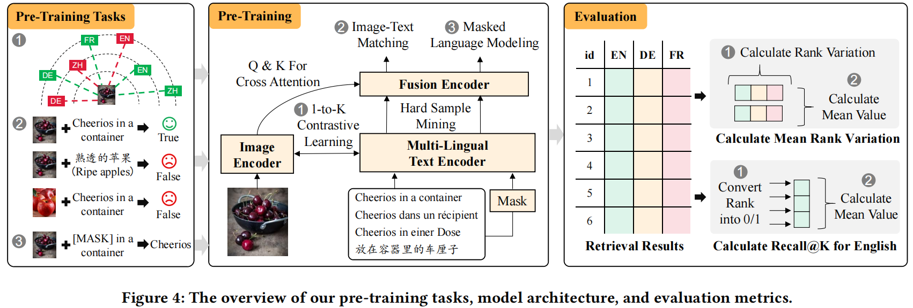
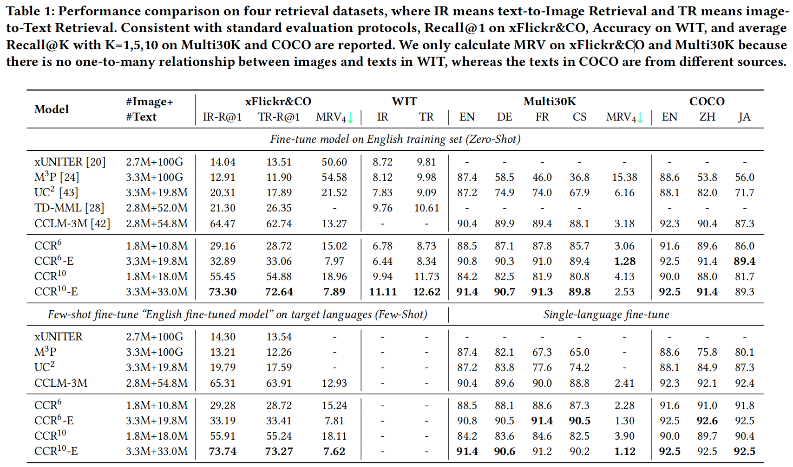

# CCRK: Improving the Consistency in Cross-Lingual Cross-Modal Retrieval with 1-to-K Contrastive Learning

[](https://github.com/BUAADreamer/CCRK/blob/main/licence)
[](https://arxiv.org/abs/2406.18254)
[](https://pytorch.org/)

[](https://paperswithcode.com/sota/zero-shot-cross-lingual-text-to-image-1?p=improving-the-consistency-in-cross-lingual)
[](https://paperswithcode.com/sota/zero-shot-cross-lingual-image-to-text-1?p=improving-the-consistency-in-cross-lingual)
[](https://paperswithcode.com/sota/zero-shot-cross-lingual-text-to-image?p=improving-the-consistency-in-cross-lingual)
[](https://paperswithcode.com/sota/zero-shot-cross-lingual-image-to-text?p=improving-the-consistency-in-cross-lingual)

>Cross-lingual Cross-modal Retrieval (CCR) is an essential task in web search, which aims to break the barriers between modality and language simultaneously and achieves image-text retrieval in the multi-lingual scenario with a single model. In recent years, excellent progress has been made based on cross-lingual cross-modal pre-training; particularly, the methods based on contrastive learning on large-scale data have significantly improved retrieval tasks. However, these methods directly follow the existing pre-training methods in the cross-lingual or cross-modal domain, leading to two problems of inconsistency in CCR: The methods with cross-lingual style suffer from the intra-modal error propagation, resulting in inconsistent recall performance across languages in the whole dataset. The methods with cross-modal style suffer from the inter-modal optimization direction bias, resulting in inconsistent rank across languages within each instance, which cannot be reflected by Recall@K. To solve these problems, we propose a simple but effective 1-to-K contrastive learning method, which treats each language equally and eliminates error propagation and optimization bias. In addition, we propose a new evaluation metric, Mean Rank Variance (MRV), to reflect the rank inconsistency across languages within each instance. Extensive experiments on four CCR datasets show that our method improves both recall rates and MRV with smaller-scale pre-trained data, achieving the new state-of-art.

<div align="center">
    
    
</div>

## Requirements

- Install python3 environment

```shell
conda create -n ccrk python=3.8.8
conda activate ccrk
pip3 install -r requirements.txt
```

## Checkpoints
We pretrain the model for only 30 epochs on 2 A100 GPUs. The batch size is set to 128.

|                                             Checkpoint                                              |     Pretrain Dataset     |
|:---------------------------------------------------------------------------------------------------:| :----------------------: |
| [CCR-10-2M-30epoch](https://huggingface.co/BUAADreamer/CCRK/resolve/main/ccrk_2m_10lan_epoch_29.th) |       `CC2M 10lan`       |
| [CCR-10-3M-30epoch](https://huggingface.co/BUAADreamer/CCRK/resolve/main/ccrk_3m_10lan_epoch_29.th) | `CC2M+COCO+VG+SBU 10lan` |

**Notes**:

* `2M` : `CC2M`
* `3M` : `CC2M+SBU+VG+COCO` , SBU/VG/COCO splits are borrowed from CCLM.
* `CC2M` : Because of many broken links, we only collect 1863804 images of Conceptual Captions Dataset.
* `10lan` : `zh,en,de,fr,ja,cs,id,es,ru,tr`

## data

- Download data from corresponding websites
- If running pre-training scripts:
  - download pre-trained models for parameter initialization
    - image encoder: [swin-transformer-base](https://github.com/SwinTransformer/storage/releases/download/v1.0.0/swin_base_patch4_window7_224_22k.pth)
    - text encoder: [xlm-roberta-large](https://huggingface.co/xlm-roberta-large)
- Organize these files like this:

```
CCRK/
    data/
        xlm-roberta-large/...
        swin_base_patch4_window7_224_22k.pth
        finetune/
        	mscoco/...
        	multi30k/...
    	
    iglue/
        datasets/...
    
    images/
        flickr30k-images/*.jpg
        coco/
            train2014/*.jpg
            val2014/*.jpg
            test2015/*.jpg
        image_data_train/
        	image_pixels/*.csv
        wit_test/
        	*.csv

pretrain_data/
    translated_4M/
        cc3m-mm-data-all/
          part_*.data
        vg-mm-data-all/
          part_*.data
        coco-mm-data-all/
          part_*.data
        cc3m-mm-data-all/
          part_*.data
    ccrk_2m_10lan_epoch_29.th
    ccrk_3m_10lan_epoch_29.th
```

## Pretrain

```shell
# CCRK 2M 6lan
python3 run.py --task "pretrain" --dist "1" --output_dir "output/CCRK-2m-6lan" --seed 42 --config configs/Pretrain_2m.yaml --pret_para "--language_chosen zh,ja,en,de,fr,cs" --device "c2"

# CCRK 2M 10lan
python3 run.py --task "pretrain" --dist "1" --output_dir "output/CCRK-2m-10lan" --seed 42 --config configs/Pretrain_2m.yaml --device "c2"

# CCRK 3M 6lan
python3 run.py --task "pretrain" --dist "1" --output_dir "output/CCRK-3m-6lan" --seed 42 --config configs/Pretrain_3m.yaml --pret_para "--language_chosen zh,ja,en,de,fr,cs" --device "c2"

# CCRK 3M 10lan
python3 run.py --task "pretrain" --dist "1" --output_dir "output/CCRK-3m-10lan" --seed 42 --config configs/Pretrain_3m.yaml --device "c2"
```

For distributed training across nodes, see run.py for more details.

### Data

To facilitate research on multi-lingual multi-modal pre-training, we provide the text translation of [`COCO+VG+SBU+CC3M`](https://drive.google.com/drive/folders/1lkRMFKSdz9bXhpB0n8eELF0ztbVmcBp6?usp=share_link), which contains 10 language: `zh/en/de/fr/ja/cs/id/tr/ru/es`

If you want to translate more languages, please refer to `translation/README.md`

**Please cite the corresponding papers appropriately and download the images from their websites.**

For more details, please read the code dataset/pretrain_dataset_multilingual.py (more specifically ImageMultiTextDataset) to see what format is needed.

## Finetune

We finetune the model for every dataset on 4 V100 GPUs.

### Data: MSCOCO and Multi30K

Please download MSCOCO, Multi30K from the corresponding websites. We provide some links for reference.

- MSCOCO 

  - ja https://github.com/yahoojapan/YJCaptions
  - en https://cs.stanford.edu/people/karpathy/deepimagesent/caption_datasets.zip
  - zh https://github.com/li-xirong/coco-cn

* Multi30k
  * [https://github.com/multi30k/dataset](https://github.com/multi30k/dataset)

For these two datasets, you need to additionally reformulate the train json files like this:

```json
[
    {
        "caption": "A woman wearing a net on her head cutting a cake. ",
        "image": "coco/val2014/COCO_val2014_000000522418.jpg",
        "image_id": 522418
    }, ...
]
```

and the valid and test files like this:

```json
[
    {
        "image": "coco/val2014/COCO_val2014_000000391895.jpg",
        "caption": [
            "A man with a red helmet on a small moped on a dirt road. ",
            "Man riding a motor bike on a dirt road on the countryside.",
            "A man riding on the back of a motorcycle.",
            "A dirt path with a young person on a motor bike rests to the foreground of a verdant area with a bridge and a background of cloud-wreathed mountains. ",
            "A man in a red shirt and a red hat is on a motorcycle on a hill side."
        ],
        "image_id": 391895
    }, ...
]
```

------

### Data: IGLUE

For IGLUE, you just need to clone [this repo](https://github.com/e-bug/iglue) and place it in the root path of our repo as follows. Our code works on the original annotations of IGLUE without any preprocess.

```
CCRK/
    iglue/
        datasets/...
```

For WIT, please download the `image_data_train.tar` and test images from its [kaggle](https://www.kaggle.com/c/wikipedia-image-caption/data) webpage, and extract them to `images` , `images/wit_test` seperately.

Tips for WIT:

- The download link of `image_data_train.tar` is in **Data Description**.
- You need to extract the files again in `images/image_data_train/image_pixels` and `iglue/datasets/wit/annotations/train_en.jsonl.zip`)

------

### Retrieval Tasks: Multi30K and MSCOCO

```shell
# English-only Fine-tune
## Multi30K
python3 run.py --dist 1 --task itr_multi30k --config configs/cclm-base-ft/Retrieval_multi30k_en_ft.yaml --output_dir output/multi30k --bs 64 --seed 42 --epoch 10 --checkpoint ../pretrain_data/ccrk_3m_10lan_epoch_29.th --device "c4"

## MSCOCO
python3 run.py --dist 1 --task itr_coco --config configs/cclm-base-ft/Retrieval_coco_en_ft.yaml --output_dir output/mscoco --bs 64 --seed 42 --epoch 10 --checkpoint ../pretrain_data/ccrk_3m_10lan_epoch_29.th --device "c4"
## split train and test to speed up
python3 run.py --dist 1 --task itr_coco --config configs/cclm-base-ft/Retrieval_coco_en_ft.yaml --output_dir output/mscoco --bs 64 --seed 42 --epoch 10 --checkpoint output/mscoco/checkpoint_best.pth --device "c4" --evaluate

# Single-Language Fine-tune
## Multi30K, optional language: cs/de/fr
python3 run.py --dist 1 --task itr_multi30k --config configs/cclm-base-ft/Retrieval_multi30k_cs_ft.yaml --output_dir output/multi30k/cs --bs 64 --seed 42 --epoch 10 --checkpoint output/multi30k/checkpoint_best.pth --device "c4"

## MSCOCO, optional config: ja/zh
python3 run.py --dist 1 --task itr_coco --config configs/cclm-base-ft/Retrieval_coco_ja_ft.yaml --output_dir output/mscoco/zh --bs 64 --seed 42 --epoch 10 --checkpoint output/mscoco/checkpoint_best.pth --device "c4"
```

------

### IGLUE: Zero-Shot

We provide examples of fine-tuning on English train set and evaluating on the test sets of other languages.

```shell
# xFlickr&CO
python3 run.py --dist 1 --task xflickrco --output_dir output/xflickrco --checkpoint ../pretrain_data/ccrk_3m_10lan_epoch_29.th --bs 64 --seed 42 --device "c4"

# WIT
python3 run.py --dist 1 --task wit --output_dir output/wit --bs 80 --seed 42 --checkpoint ../pretrain_data/ccrk_3m_10lan_epoch_29.th --device "c4"
```

------

### IGLUE: Few-Shot

We also evaluate CCLM on IGLUE max-shot settings. **Note** that you need to finetune the pretrained model on English first, then load the checkpoints for few-shot learning.

```shell
# xFlickr&CO, optional language: de/es/id/ja/ru/tr/zh
python3 run.py --dist 1 --task xflickrco --output_dir output/xflickrco/zh --checkpoint output/xflickrco/checkpoint_best.pth --bs 64 --seed 42 --fewshot de,100 --lr 1e-6 --device "c4"
```

The value after language in `--fewshot` settings of xFlickr&CO is the number of few-shot samples, where we always use the maximum values.

### MRV

After all language of models are finetuned, we can evaluate MRV using following command:

```shell
python3 run.py --task xflickrco --dist "1" --output_dir output/xflickrco/test --bs 64 --seed 42 --device "c4" --checkpoint output/xflickrco/checkpoint_best.pth --evaluate --fewshot de,100 --ft_para " --model_cap ccrk_3m_10lan --checkpoint_fmt output/xflickrco/format/checkpoint_best.pth"
```

Specific implementation of MRV can be found in the `analysis_ranks` function of `xFlickrCO.py`. We calculate mean rank variation of four models `en,de,ja,zj`. 

## Citation
If this work is helpful, please kindly cite as:

```bibtex
@article{nie2024improving,
  title={Improving the Consistency in Cross-Lingual Cross-Modal Retrieval with 1-to-K Contrastive Learning},
  author={Nie, Zhijie and Zhang, Richong and Feng, Zhangchi and Huang, Hailang and Liu, Xudong},
  journal={arXiv preprint arXiv:2406.18254},
  year={2024}
}
```

## Acknowledgement

About code, Our project is based on [CCLM](https://github.com/zengyan-97/CCLM).

About pretraining datasets, `zh,ja,de,fr,cs` texts in `cc3m` are translated by [UC2](https://github.com/zmykevin/UC2) while `zh,ja,de,fr,cs` texts in `sbu/coco/vg` are translated by [CCLM](https://github.com/zengyan-97/CCLM). For other languages `id,es,ru,tr`, we use `m2m_100_1.2B` model developed by [Meta AI](https://ai.facebook.com/research/) and [EasyNMT](https://github.com/UKPLab/EasyNMT) as a tool to translate all datasets from English.

Thanks for their great jobs!
